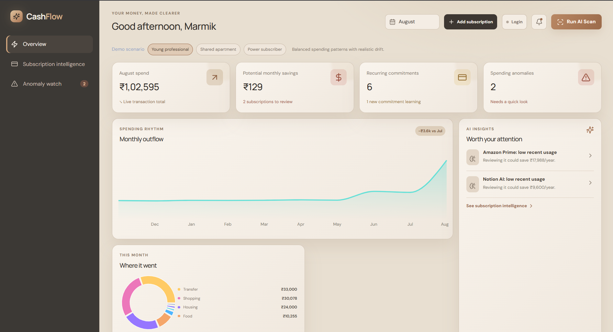
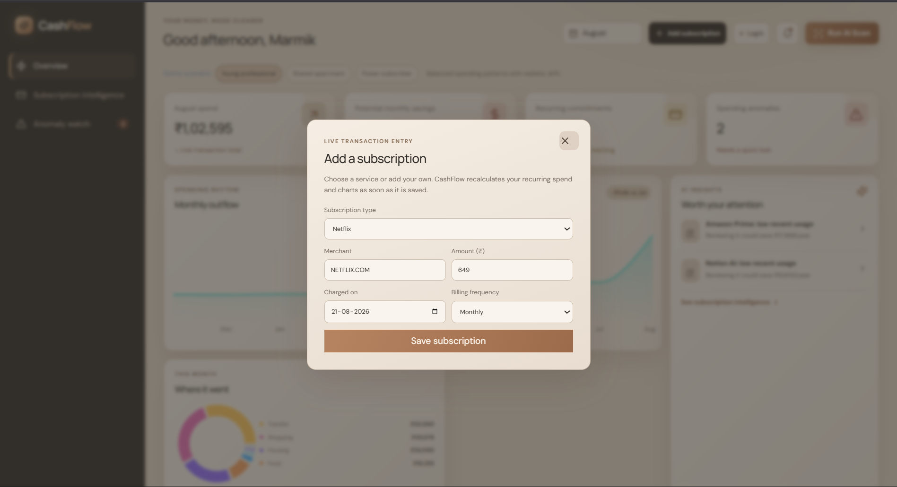
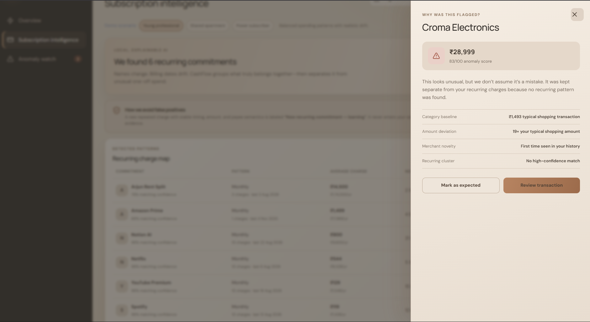

# CashFlow-subscription_manager

CashFlow
CashFlow is a polished, local-first fintech prototype that makes dense transaction histories understandable. It detects messy recurring charges, surfaces forgotten subscriptions, explains spending anomalies, and deliberately protects new recurring commitments from premature “waste” labels.

Run locally
This project needs Node.js 18.18+ (Node 20+ recommended).

Then open https://cashflow-psi-gray.vercel.app/. For a production check, run pnpm build and pnpm start.

Supabase live mode
The app is connected to the configured Supabase project through the browser-safe anon key in .env.local. To enable secure live data:

Open the Supabase Dashboard SQL Editor for the project.
Run supabase/schema.sql once. It creates the transaction tables, Row Level Security policies, and realtime publication.
Start CashFlow and click Connect data to create or sign in to a Supabase Auth account.
Import transaction rows into public.transactions with that user’s Auth UUID in user_id.
CashFlow listens for inserts, updates, and deletes on public.transactions and refreshes the dashboard automatically. If there is no signed-in user or no live rows yet, it safely shows the synthetic demo dataset instead. The public anon key is protected by the RLS policies; never place a service_role key in the browser or a NEXT_PUBLIC_* variable.

Demo flow (about two minutes)
Start on Overview and click Run AI Scan to show the three-stage intelligence pass.
Point out the monthly KPI cards, trend, spending distribution, and the two tailored AI insights.
Open the Netflix insight to show merchant aliases, timing, price increase, usage proxy, and the recommended action in the explainability drawer.
Open Subscription intelligence to show all detected patterns—including NETFLIX.COM / Netflix Mumbai / Nflx*Streaming grouped together.
Highlight Arjun Rent Split. It has only three stable payments, so it is “learning,” excluded from savings, and can be classified as a shared expense.
Click Anomaly watch or an anomaly card to demonstrate that a one-off high-value payment is investigated separately from recurring commitments.
Change the scenario chips to show the tailored demo narrative.
Architecture
app/                 Next.js route and global fintech design system
components/          Interactive dashboard, intelligence table, scan state, drawer
lib/data.ts          Ten months of synthetic, India-focused bank transactions
lib/intelligence.ts  Deterministic local transaction intelligence pipeline
lib/types.ts         Shared domain model
How the AI logic works
The demo intentionally avoids API keys. lib/intelligence.ts provides a transparent, deterministic stand-in for semantic matching:

Merchant descriptions are normalized and tokenized, removing common bank-statement noise.
An explainable bag-of-token fingerprint and cosine-style similarity unite aliases such as SPOTIFY P and Spotify AB.
Cadence and amount variance then score recurrence even when bill dates drift slightly.
Anomaly scoring uses category deviation, merchant novelty, and an explicit recurring-cluster exclusion—so expensive recurring commitments are not automatically called anomalies.
Silent-subscription risk combines recurrence confidence, annual cost, engagement proxy, duplicate-service likelihood, and price-increase signals.
Guardrail: new recurring commitments
Two to three payments with similar amount, timing, and semantic payee matching become New recurring commitment — learning. The demo’s Arjun Rent Split is classified this way. It is excluded from possible savings and requires user classification or stronger evidence (inactivity, duplicate coverage, or low value) before any cancellation suggestion.

Moving to production
Replace the lightweight fingerprint in lib/intelligence.ts with transaction-description embeddings (for example, OpenAI embeddings) stored in a vector index. Use cosine similarity over those vectors alongside merchant enrichment and account context. Ingest through a consented aggregator such as Plaid or region-appropriate Open Banking rails, or parse uploaded statements into the same Transaction schema. The existing cadence, anomaly, risk, and explanation layers can then operate on real transactions while retaining audit-friendly feature contributions.

Never infer a cancellation from a model score alone: require an explicit user action and maintain a review trail.
